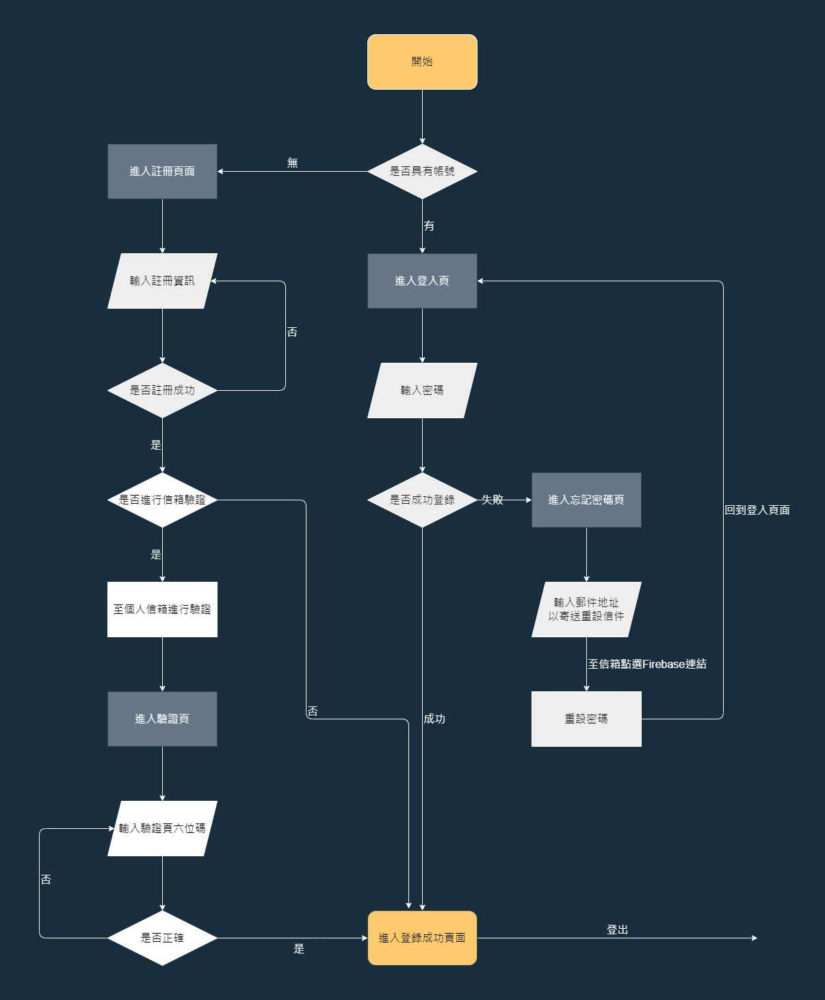

## 網頁簡易登入頁面
***
本作品為簡易會員登入頁面，進入登入頁後，使用流程如下圖

***
###### 使用技術如下:
* Next.js
* React Hooks
* Redux
* Material UI
* Firebase Authentication

由於Firebase Authentication 具有信件驗證及密碼重設功能服務，因此將模板中具有之驗證頁面進行簡易修改:

驗證信件中之連結將導引使用者至驗證頁面，該頁面會隨機產生6位數組供使用者輸入，若輸入成功則導入登入成功頁(若已處於登入狀態，否則進入登入頁)，若輸入失敗則煩請使用者再檢查一遍，或於10秒後按下重試按鈕刷新數組重新輸入。

由於並未將檔案上線至任何Hosting，還請將repository clone至本地端使用 npm run dev 或 npm run start進行功能查看

